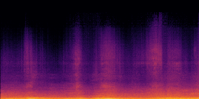

# Echoes-of-Art: Translating Audio into Art with Neural Style Transfer

## Table of Contents
- [Project Overview](#project-overview)
- [Features](#features)
- [Example Output](#example-output)
- [Requirements](#requirements)
- [Setup](#setup)
- [Usage](#usage)
- [Acknowledgements](#acknowledgements)

## Project Overview
Echoes of Art is a creative AI project developed for IAT460: Generative AI and Computational Creativity. It explores how sound can be visually represented by converting audio inputs such as music, speech, or environmental noise into spectrograms and then stylizing them using Neural Style Transfer (NST). The result is a visual representation of sound that challenges the traditional notion of audio as solely an auditory experience, reimagining it through visual interpretation inspired by iconic works of art.

## Features
- **Audio-to-Spectrogram Conversion**: The input audio is converted into a spectrogram, a visual representation of the sound frequencies.
- **Neural Style Transfer (NST)**: Using a pre-trained NST model, the project transforms audio spectrogram into artworks styled after famous paintings, such as Vincent van Gogh's *The Starry Night* or Hokusai *The Great Wave off Kanagawa*.
- **Multiple Style Options**: Users can choose from five classical painting to style their spectrogram after.

## Example Output

| Input Spectrogram                         | Stylized Output (The Scream)          |
|------------------------------------------|-----------------------------------------|
|  |  |

*The stylized output applies the style of Edvard Munch's “The Scream” (see Available Styles section for all painting styles).*

## Requirements
- Python 3.x
- gradio (for the web interface)
- librosa (for audio processing)
- matplotlib (for spectrogram visualization)
- numpy (numerical operations)
- Pillow (image handling)
- tensorflow + tensorflow-hub (style transfer model)

## Setup
1. **Clone the Repository**: To view or modify this project, clone the repository using Git:
   ```bash
   git clone https://github.com/Ry-an7/Echoes-of-Art
   cd Echoes-of-Art
   ```
2. **Install the required dependencies**: You can install all the necessary libraries by running:
    ``` bash
    pip install -r requirements.txt
    ```
    Alternatively, if you're installing manually, run:
    ``` bash
    pip install gradio librosa matplotlib numpy Pillow tensorflow tensorflow-hub soundfile
    ```
## Usage
1. ### Open the Project in Google Colab <br>
   First, open the project in Google Colab. Once the notebook is open:
   - **Adjust the painting paths** to match the correct directory where your painting images are stored. Look for the section in the code where the painting paths are defined:
   ``` bash
   style_images = {
    "Starry Night": "Desktop/Echoes_of_Art/Paintings/StarryNight.jpg",
    "The Scream": "Desktop/Echoes_of_Art/Paintings/Scream.jpg",
    "The Great Wave": "Desktop/Echoes_of_Art/Paintings/Wave.jpg",
    "Impression, Sunrise": "Desktop/Echoes_of_Art/Paintings/Sunrise.jpg",
    "Persistence of Memory": "Desktop/Echoes_of_Art/Paintings/PersistenceofMemory.jpg",
   }
   ```
   **Update the paths** to match the location of the painting images on your system. The folder containing the paintings, named `Paintings`, is included in the zip folder. Make sure the paths point to the correct directory where the paintings are stored.
2. ### Run the Notebook <br>
   After making necessary adjustments, run the notebook by clicking the Run button at the top of the Colab interface to execute the code.
3. ### Access the Interface
   Once the notebook is running, you will see an output in the cell with a link like:
   ``` bash
   Running on local URL:  http://127.0.0.1:7944
   ```
   Click on the local URL link to open the Gradio interface and start interacting with the application.
4. ### Record or Upload Your Audio <br>
     You can either upload an audio file or record directly using your microphone in the provided Gradio interface.
   - **To upload an audio file:**<br>
     Click on the "Upload Audio" tab and select the file you want to use. The supported file types are audio files (e.g., .mp3, .wav).
   - **To record audio using the microphone:**<br>
     Click on the "Record Audio" tab, and press the "Record" button to record your audio.<br>
     **Note:** Make sure to **allow the browser** to access your microphone when prompted in order to record audio.
5. ### Generate the Spectrogram <br>    
   After uploading or recording your audio, click the "Generate from Upload/Recording" button and view the spectrogram on the right.
6. ### Select a Painting Style<br>
     After the spectrogram is generated, **choose a painting style** using the corresponding painting buttons to apply to the generated spectrogram. Available styles include:
   - **The Starry Night by Vincent van Gogh**
   - **The Scream by Edvard Munch**
   - **The Great Wave off Kanagawa by Hokusai**
   - **Impression, Sunrise by Claude Monet**
   - **Persistence of Memory by Salvador Dalí**

   Click on the button for your preferred style to apply Neural Style Transfer (NST).
7. ### View the Stylized Result <br>
   Once the transformation is complete, the resulting image will appear at the bottom as a unique, stylized version of your spectrogram, enhanced by creative noise, a chance for random pixel movement, and the selected painting style.

## Acknowledgements
- This project uses a pretrained model from [TensorFlow Hub](https://www.tensorflow.org/tutorials/generative/style_transfer) for neural style transfer, based on the tutorial provided.
- This project utilizes [Gradio](https://www.gradio.app/) for creating the user interface.
